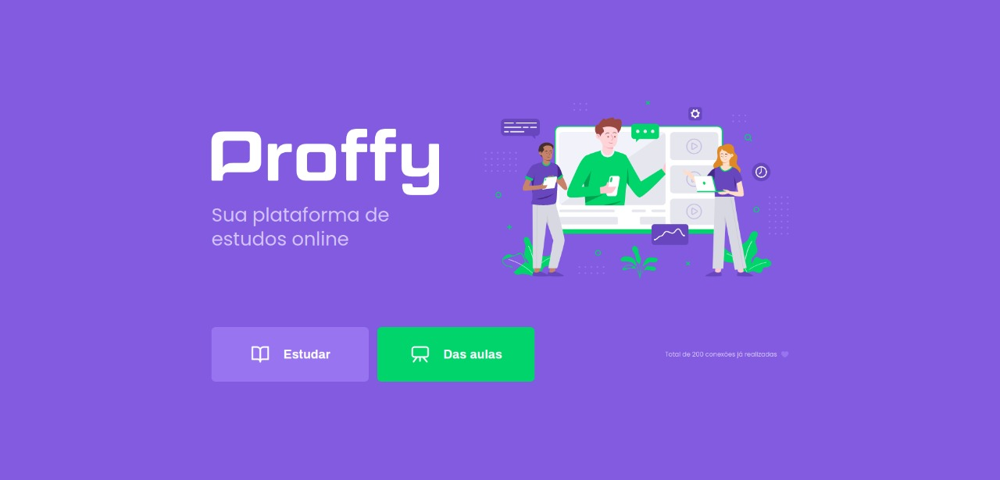

<h1 align="center">
    
</h1>

<h4 align="center">
	
NextLevelWeek #02 🚀

  
Trilha Discovery

</h4>

  

  

  

  

  

  

  

## :information_source:  O que é Next Level Week?

A NLW é uma semana prática com muito código, desafios, network e com um único objetivo: levá-lo ao próximo nível.

Programação é uma disciplina prática. Ou seja, para dominar uma tecnologia não basta apenas conhecer a teoria ou ler a documentação: você precisa colocar a mão no código.

Através do método da [Rocketseat][rs], você aprenderá novas ferramentas, tecnologias e descobrirá hacks que irão impulsionar sua carreira.

Uma experiência online e totalmente gratuita para evoluir suas habilidades em programação e colocar mais um trabalho completo no seu portfolio.

## 💻 Projeto

👨‍🏫 Proffy é um projeto desenvolvido com o objetivo de conectar as pessoas que buscam algum tipo de aula particular à profesores que oferecem essas aulas. O Projeto foi desenvolvido seguindo a trilha Discovery da Semana [NLW](https://nextlevelweek.com).

<h3 align="center">
    
</h3>

## 🤔 Como contribuir para o projeto

- Faça um **fork** do projeto;
- Crie uma nova branch com as suas alterações: `git checkout -b my-feature`
- Salve as alterações e crie uma mensagem de commit contando o que você fez:`git commit -m "feature: My new feature"`
- Envie as suas alterações: `git push origin my-feature`

> Caso tenha alguma dúvida confira este [guia de como contribuir no GitHub](https://github.com/firstcontributions/first-contributions)

## :memo: Licença

Este projeto esta sobe a licença MIT. Veja a [LICENÇA][license] para saber mais.

Att. Anderson Pacheco 👨‍💻  [Vamos conversar!](https://www.linkedin.com/in/anderson-pacheco-oliveira-506474a1)

[nodejs]: https://nodejs.org/
[typescript]: https://www.typescriptlang.org/
[expo]: https://expo.io/
[reactjs]: https://reactjs.org
[rn]: https://facebook.github.io/react-native/
[vs]: https://code.visualstudio.com/
[rs]: https://rocketseat.com.br
[license]: https://opensource.org/licenses/MIT
